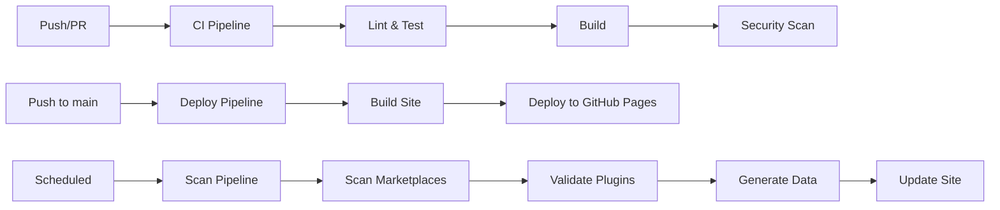

# Claude Marketplace Aggregator

<div align="center">


[](https://github.com/shrwnsan/claude-marketplace-registry/releases/tag/v0.3.0-beta.1)
[](./CHANGELOG.md)
[](https://github.com/shrwnsan/claude-marketplace-registry/actions/workflows/ci.yml)
[](https://github.com/shrwnsan/claude-marketplace-registry/actions/workflows/deploy.yml)
[](https://github.com/shrwnsan/claude-marketplace-registry/actions/workflows/scan.yml)
[](https://github.com/shrwnsan/claude-marketplace-registry/actions/workflows/monitoring.yml)
[](https://github.com/shrwnsan/claude-marketplace-registry/actions/workflows/backup.yml)

[](https://opensource.org/licenses/MIT)
[](https://www.typescriptlang.org/)
[](https://nextjs.org/)
[](https://nodejs.org/)
[](https://codecov.io/gh/shrwnsan/claude-marketplace-registry)

**🚀 Production-ready, automated, open-source aggregator that discovers and curates Claude Code marketplaces and plugins from across GitHub with comprehensive monitoring and disaster recovery**

[🌐 Live Demo](https://shrwnsan.github.io/claude-marketplace-registry) • [📖 Documentation](./docs) • [🤝 Contributing](./CONTRIBUTING.md) • [🐛 Report Issues](https://github.com/shrwnsan/claude-marketplace-registry/issues)

</div>

---

## ✨ Features

### 🎯 Core Functionality
- 🔍 **Automated Discovery**: Continuously scans GitHub for new Claude marketplaces and plugins
- 📊 **Comprehensive Analytics**: Track marketplace statistics, trends, and popularity metrics
- 🎯 **Smart Filtering**: Filter by language, category, tags, and quality metrics
- 🔄 **Real-time Updates**: Scheduled scanning every 6 hours with automatic deployment
- 🌐 **Static Site**: Fast, secure, and SEO-optimized with GitHub Pages hosting
- 📱 **Responsive Design**: Works perfectly on desktop, tablet, and mobile devices
- ⚡ **Performance Optimized**: Blazing fast with Next.js static generation
- 🔒 **Security First**: Built with security best practices and validation

### 📈 Monitoring & Observability
- 🏥 **Health Monitoring**: `/data/health.json` static file for basic system health checks
- 📊 **System Status**: `/data/status.json` static file for detailed system diagnostics
- 📈 **Performance Metrics**: `/data/metrics.json` static file with performance metrics
- 📉 **Analytics Dashboard**: `/data/analytics.json` static file with comprehensive ecosystem insights
- 🔔 **Automated Alerts**: Real-time monitoring with Slack/webhook notifications
- 📋 **Uptime Tracking**: Continuous monitoring with incident response procedures

### 💾 Data Management & Recovery
- 🔒 **Automated Backups**: Every 6 hours with compression and integrity verification
- 📦 **Versioned Backups**: Daily, weekly, and monthly backup retention
- 🔄 **One-Click Restore**: Emergency restoration procedures with verification
- ✅ **Data Integrity**: SHA-256 checksums and validation checks
- 🗂️ **Backup Management**: Automated cleanup and retention policies
- 🚨 **Disaster Recovery**: Comprehensive recovery plans and procedures

### 🛠️ Development & Operations
- 🔧 **CI/CD Pipeline**: Automated testing, building, and deployment
- 🧪 **Comprehensive Testing**: Unit, integration, and E2E tests with 90%+ coverage
- 📝 **Documentation**: Extensive documentation for users and developers
- 🔐 **Security Scanning**: Automated vulnerability scanning and dependency updates
- 📊 **Performance Monitoring**: Core Web Vitals tracking and optimization
- 🔄 **Dependency Management**: Automated updates and security patches

---

## 🚀 Quick Start

### Prerequisites

- Node.js 18.x or higher
- npm 8.x or higher
- GitHub Personal Access Token (for API access)

### Installation

1. **Clone the repository**
   ```bash
   git clone https://github.com/shrwnsan/claude-marketplace-registry.git
   cd claude-marketplace-registry
   ```

2. **Install dependencies**
   ```bash
   npm install
   ```

3. **Set up environment variables**
   ```bash
   cp .env.example .env.local
   ```

   Edit `.env.local` and add your configuration:
   ```env
   GITHUB_TOKEN=ghp_your_personal_access_token_here
   NEXT_PUBLIC_BASE_PATH=/claude-marketplace-aggregator
   ```

   **Environment Variables:**
   - `GITHUB_TOKEN`: Your GitHub Personal Access Token for API access
   - `NEXT_PUBLIC_BASE_PATH`: Base path for GitHub Pages deployment (should match your repository name)

   **Base Path Configuration:**
   - For GitHub Pages, set `NEXT_PUBLIC_BASE_PATH` to `/{your-repository-name}`
   - For local development, you can leave it empty or set to `/`
   - Example: If your repo is `shrwnsan/claude-marketplace-registry`, use `/claude-marketplace-registry`

4. **Add favicon assets** (required for production deployment)

   Create the following favicon files in the `public/` directory:

   ```bash
   # Basic favicon files (required)
   public/
   ├── favicon.ico          # 16x16, 32x32, 48x48
   ├── favicon.svg          # Scalable vector icon
   ├── apple-touch-icon.png # 180x180 for iOS
   └── site.webmanifest      # Web app manifest
   ```

   **Favicon Specifications:**
   - `favicon.ico`: Multi-size ICO file (16x16, 32x32, 48x48 pixels)
   - `favicon.svg`: Scalable vector graphics icon (any size)
   - `apple-touch-icon.png`: PNG file, 180x180 pixels for iOS devices
   - `site.webmanifest`: JSON manifest file for web app configuration

5. **Run the development server**
   ```bash
   npm run dev
   ```

6. **Open your browser**

   Navigate to [http://localhost:3000](http://localhost:3000)

---

## 📋 Available Scripts

| Script | Description |
|--------|-------------|
| `npm run dev` | Start development server |
| `npm run build` | Build for production |
| `npm run start` | Start production server |
| `npm run lint` | Run ESLint |
| `npm run type-check` | Run TypeScript type checking |
| `npm run test` | Run test suite |
| `npm run test:coverage` | Run tests with coverage |
| `npm run scan:marketplaces` | Scan for new marketplaces |
| `npm run validate:plugins` | Validate discovered plugins |
| `npm run generate:data` | Generate website data |
| `npm run scan:full` | Run complete scanning pipeline |
| `npm run format` | Format code with Prettier |

---

## 🔄 CI/CD Pipeline

This project uses GitHub Actions for continuous integration and deployment:

### Workflow Overview



### CI Workflow (`.github/workflows/ci.yml`)

- **Triggers**: Push to main/develop, Pull requests
- **Steps**:
  - ✅ Code linting and formatting checks
  - 🔍 TypeScript type validation
  - 🧪 Comprehensive test suite
  - 🔨 Production build verification
  - 🔒 Security audit and CodeQL analysis
  - 📊 Test coverage reporting

### Deploy Workflow (`.github/workflows/deploy.yml`)

- **Triggers**: Push to main branch
- **Steps**:
  - 🏗️ Build Next.js static site
  - 📦 Optimize assets and bundles
  - 🚀 Deploy to GitHub Pages
  - 📈 Generate deployment reports

### Scan Workflow (`.github/workflows/scan.yml`)

- **Triggers**: Every 6 hours (cron), Manual dispatch
- **Steps**:
  - 🔍 Search GitHub for marketplaces
  - ✅ Validate plugin manifests
  - 📊 Generate data files
  - 🔄 Update website content
  - 📝 Create summary reports

---

## 📊 Project Structure

```
claude-marketplace-aggregator/
├── .github/
│   └── workflows/           # GitHub Actions workflows
│       ├── ci.yml           # Continuous Integration
│       ├── deploy.yml       # Deployment to GitHub Pages
│       └── scan.yml         # Scheduled marketplace scanning
├── data/                    # Generated data files
│   ├── marketplaces/        # Marketplace data
│   ├── plugins/             # Plugin data
│   └── generated/           # Processed data
├── docs/                    # Project documentation
├── public/                  # Static assets
│   └── data/                # Website data files
├── scripts/                 # Data processing scripts
│   ├── scan-marketplaces.ts # Marketplace scanner
│   ├── validate-plugins.ts  # Plugin validator
│   └── generate-data.ts     # Data generator
├── pages/                   # Next.js pages
│   ├── _app.tsx           # App wrapper
│   ├── _document.tsx      # Document structure
│   ├── index.tsx          # Homepage
│   ├── api/               # API routes
│   ├── marketplaces/      # Marketplace pages
│   ├── plugins/           # Plugin pages
│   ├── admin/             # Admin pages
│   ├── demo/              # Demo pages
│   └── docs/              # Documentation pages
├── src/
│   ├── components/        # React components
│   ├── contexts/          # React contexts
│   ├── hooks/             # Custom React hooks
│   ├── types/             # TypeScript type definitions
│   ├── utils/             # Utility functions
│   ├── services/          # API services
│   ├── parsers/           # Data parsers
│   └── data/              # Static data and mock data
├── .env.example            # Environment variables template
├── next.config.js          # Next.js configuration
├── package.json            # Dependencies and scripts
└── README.md               # This file
```

---

## 🔧 Configuration

### Environment Variables

Copy `.env.example` to `.env.local` and configure the following variables:

#### Required Variables

```env
# GitHub Configuration
GITHUB_TOKEN=ghp_your_personal_access_token_here
GITHUB_USERNAME=your_github_username

# Site Configuration
NEXT_PUBLIC_SITE_URL=http://localhost:3000
NEXT_PUBLIC_GITHUB_REPO=shrwnsan/claude-marketplace-registry
```

#### Optional Variables

```env
# Scanning Configuration
GITHUB_RATE_LIMIT=5000
SEARCH_QUERY=claude-plugin marketplace.json
MAX_MARKETPLACES=1000

# Feature Flags
ENABLE_ANALYTICS=false
ENABLE_DARK_MODE=true

# Analytics (Optional)
GOOGLE_ANALYTICS_ID=
UMAMI_WEBSITE_ID=
```

### GitHub Token Setup

1. Go to [GitHub Settings > Developer settings > Personal access tokens](https://github.com/settings/tokens)
2. Click "Generate new token"
3. Select the following scopes:
   - `public_repo` (Access public repositories)
   - `read:org` (Read org and team membership)
4. Copy the token and add it to your `.env.local`

---

## 🛠️ Development Guide

### Adding New Features

1. **Create a feature branch**
   ```bash
   git checkout -b feature/your-feature-name
   ```

2. **Make your changes**
   - Follow the existing code style
   - Add TypeScript types for new code
   - Write tests for new functionality
   - Update documentation

3. **Test your changes**
   ```bash
   npm run lint
   npm run type-check
   npm run test
   npm run build
   ```

4. **Commit and push**
   ```bash
   git add .
   git commit -m "feat: add your feature description"
   git push origin feature/your-feature-name
   ```

5. **Create a Pull Request**

### Code Style

This project uses:
- **ESLint** for code linting
- **Prettier** for code formatting
- **TypeScript** for type safety
- **Husky** for git hooks

Automatic formatting is applied on commit via lint-staged.

### Testing

```bash
# Run all tests
npm test

# Run tests in watch mode
npm run test:watch

# Run tests with coverage
npm run test:coverage
```

---

## 📈 Monitoring and Analytics

### GitHub Actions Monitoring

All workflows include comprehensive monitoring:

- ✅ **Status checks**: Built-in GitHub status checks
- 📊 **Build summaries**: Detailed workflow summaries
- 📧 **Notifications**: Optional Slack/Discord notifications
- 📈 **Metrics**: Test coverage and performance metrics

### Website Analytics (Optional)

Configure analytics by setting environment variables:

```env
# Google Analytics
GOOGLE_ANALYTICS_ID=G-XXXXXXXXXX

# Umami Analytics
UMAMI_WEBSITE_ID=your-website-id
UMAMI_URL=https://your-umami-instance.com
```

---

## 🔒 Security

### Security Measures

- 🔍 **Dependency Scanning**: Automated vulnerability scanning
- 🛡️ **Content Security Policy**: CSP headers enabled
- 🔒 **Input Validation**: All user inputs are validated
- 🚫 **No Secrets**: No sensitive data in client-side code
- 📋 **Security Headers**: Best practice security headers

### Security Best Practices

1. Never commit `.env.local` files
2. Use environment variables for sensitive data
3. Keep dependencies updated
4. Review pull requests carefully
5. Use GitHub's security features

---

## 🚀 Deployment

### Automatic Deployment

The site is automatically deployed to GitHub Pages when:

- ✅ Code is pushed to the `main` branch
- ✅ All CI checks pass
- ✅ Build succeeds

### Manual Deployment

You can manually trigger deployments:

1. **From GitHub Actions**:
   - Go to Actions tab
   - Select "Deploy to GitHub Pages"
   - Click "Run workflow"

2. **From CLI**:
   ```bash
   npm run build
   npm run deploy
   ```

### Environment-Specific Configuration

- **Development**: `NODE_ENV=development`
- **Production**: `NODE_ENV=production`
- **Testing**: `NODE_ENV=test`

---

## 📚 API Reference

### Monitoring Endpoints

#### Health Check
```bash
GET /data/health.json
```
Returns basic system health status including data file status, GitHub API connectivity, build status, and memory usage.

**Response Example**:
```json
{
  "status": "healthy",
  "timestamp": "2024-01-01T00:00:00Z",
  "uptime": 86400,
  "version": "1.0.0",
  "checks": {
    "dataFiles": true,
    "githubApi": true,
    "buildStatus": true,
    "memoryUsage": true
  }
}
```

#### System Status
```bash
GET /data/status.json
```
Provides detailed system diagnostics including rate limits, performance metrics, and error counts.

**Response Example**:
```json
{
  "status": "operational",
  "timestamp": "2024-01-01T00:00:00Z",
  "uptime": 86400,
  "systems": {
    "data": {
      "status": "operational",
      "totalMarketplaces": 150,
      "totalPlugins": 1200,
      "dataFreshness": "2 hours ago"
    },
    "github": {
      "status": "operational",
      "rateLimit": {
        "limit": 5000,
        "remaining": 4500,
        "reset": "2024-01-01T01:00:00Z"
      }
    }
  }
}
```

#### Performance Metrics
```bash
GET /data/metrics.json
```
Returns performance metrics in JSON or Prometheus format.

#### Analytics Dashboard
```bash
GET /data/analytics.json
```
Comprehensive analytics data including trends, ecosystem insights, and marketplace health.

### Data Endpoints

#### Marketplace Data
```typescript
interface Marketplace {
  id: string;
  name: string;
  description: string;
  url: string;
  stars: number;
  forks: number;
  language: string;
  updatedAt: string;
  topics: string[];
  hasManifest: boolean;
  owner: string;
  repository: string;
}
```

#### Plugin Data
```typescript
interface Plugin {
  id: string;
  name: string;
  description: string;
  version: string;
  author: string;
  repository: string;
  isValid: boolean;
  metadata: {
    category: string;
    tags: string[];
    downloads: number;
    rating: number;
  };
}
```

### Available Endpoints

| Endpoint | Method | Description | Format |
|----------|--------|-------------|---------|
| `/data/health.json` | GET | Basic health check | JSON |
| `/data/status.json` | GET | Detailed system status | JSON |
| `/data/metrics.json` | GET | Performance metrics | JSON |
| `/data/analytics.json` | GET | Analytics dashboard | JSON |
| `/data/marketplaces.json` | GET | All marketplaces | JSON |
| `/data/index.json` | GET | Summary and statistics | JSON |
| `/data/plugins.json` | GET | All plugins | JSON |
| `/data/complete.json` | GET | Complete data structure | JSON |

### Rate Limiting

- **Public endpoints**: No rate limiting
- **Authenticated endpoints**: Based on GitHub API limits
- **Monitoring endpoints**: 100 requests/minute per IP
- **Data endpoints**: Cached for 5 minutes

---

## 🤝 Contributing

We welcome contributions! Please see our [Contributing Guide](./CONTRIBUTING.md) for details.

### How to Contribute

1. **Fork the repository**
2. **Create a feature branch**
3. **Make your changes**
4. **Add tests**
5. **Submit a pull request**

### Contribution Areas

- 🔍 **Marketplace Discovery**: Improve scanning algorithms
- 🎨 **UI/UX**: Enhance the website design
- 📊 **Analytics**: Add new metrics and visualizations
- 🛡️ **Security**: Improve security measures
- 📚 **Documentation**: Improve documentation

---

## 📄 License

This project is licensed under the MIT License - see the [LICENSE](./LICENSE) file for details.

---

## 🙏 Acknowledgments

- [Anthropic](https://anthropic.com) for creating Claude
- [GitHub](https://github.com) for hosting and API
- [Next.js](https://nextjs.org) for the web framework
- [Tailwind CSS](https://tailwindcss.com) for styling
- All contributors and community members

---

## 📚 Documentation

### 📋 Project Status
- **[Changelog](./CHANGELOG.md)** - Version history and release notes
- **[Current Release](https://github.com/shrwnsan/claude-marketplace-registry/releases/tag/v0.3.0-beta.1)** - Latest release (v0.3.0-beta.1)

### 📖 User Documentation
- **[User Guide](./docs/guides/USER_GUIDE.md)** - Complete guide for using the marketplace
- **[Setup Guide](./SETUP.md)** - Step-by-step installation and configuration
- **[Developer API](./docs/ref/DEVELOPER_API.md)** - Public API documentation and examples

### 🔧 Technical Documentation
- **[Security Documentation](./docs/ref/SECURITY.md)** - Security measures and best practices
- **[Maintenance Guide](./docs/guides/MAINTENANCE_GUIDE.md)** - Operations, monitoring, and troubleshooting
- **[Disaster Recovery](./docs/ref/DISASTER_RECOVERY.md)** - Backup and recovery procedures

### 🔌 Integration Documentation
- **[GitHub Integration](./docs/ref/GITHUB_INTEGRATION.md)** - Internal GitHub API implementation
- **[Contributing Guide](./CONTRIBUTING.md)** - Development workflow and contribution guidelines

### 📊 Project Documentation
- **[Product Requirements](./docs/plans/prd-001-claude-marketplace-aggregator.md)** - Complete PRD with specifications
- **[Task Breakdown](./docs/plans/tasks-001-prd-claude-marketplace-aggregator.md)** - Detailed development tasks
- **[Research Documents](./docs/plans/)** - Ecosystem analysis and development paradigms

### 📋 Documentation Structure
```
docs/
├── plans/                     # Product requirements, research, tasks
│   ├── prd-*.md              # Product requirements documents
│   ├── research-*.md         # Research and analysis documents
│   ├── tasks-*.md            # Development task breakdowns
│   ├── eval-*.md             # Evaluations and assessments
│   ├── bugs-*.md             # Bug fix plans
│   └── retro-*.md            # Retrospectives
├── guides/                    # User and maintenance guides
│   ├── USER_GUIDE.md         # User-facing documentation
│   ├── MAINTENANCE_GUIDE.md  # Operations and maintenance procedures
│   ├── quick-testing-guide.md
│   └── ecosystem-*-guide.md  # Ecosystem feature guides
└── ref/                       # Technical reference documentation
    ├── DEVELOPER_API.md      # Public REST API reference
    ├── SECURITY.md           # Security implementation and best practices
    ├── DISASTER_RECOVERY.md  # Backup and recovery procedures
    ├── GITHUB_INTEGRATION.md # Internal GitHub API implementation
    └── ARCHITECTURE.md       # System architecture
```

---

## 📞 Support

- 📖 [Documentation](./docs)
- 🐛 [Report Issues](https://github.com/shrwnsan/claude-marketplace-registry/issues)
- 💬 [Discussions](https://github.com/shrwnsan/claude-marketplace-registry/discussions)
- 📧 [Email Support](mailto:support@claude-marketplace.com)

---

<div align="center">

**Made with ❤️ by the Claude Community**

[⭐ Star this repository](https://github.com/shrwnsan/claude-marketplace-registry) • [🐛 Report issues](https://github.com/shrwnsan/claude-marketplace-registry/issues) • [💬 Suggest features](https://github.com/shrwnsan/claude-marketplace-registry/discussions)

</div>