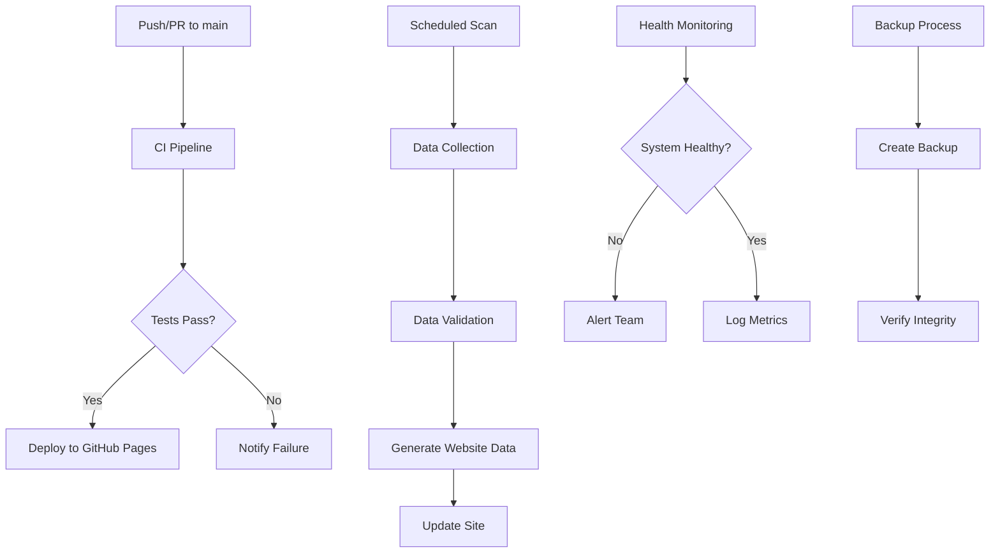

# Maintenance and Operations Guide

## Overview

This comprehensive guide provides maintenance procedures, troubleshooting steps, and operational guidance for the Claude Marketplace Aggregator. It covers automated workflows, manual procedures, monitoring, and emergency response.

## Table of Contents

1. [Maintenance Schedules](#maintenance-schedules)
2. [GitHub Actions Workflows](#github-actions-workflows)
3. [System Monitoring](#system-monitoring)
4. [Troubleshooting Procedures](#troubleshooting-procedures)
5. [Performance Optimization](#performance-optimization)
6. [Emergency Procedures](#emergency-procedures)
7. [Maintenance Scripts](#maintenance-scripts)

---

## Maintenance Schedules

### Daily Checklist

**Time**: 09:00 UTC daily
**Duration**: 15-30 minutes

#### System Health Monitoring

**Website Accessibility**:
```bash
curl -I https://claude-marketplace.github.io/aggregator
# Expected: 200 OK response
```

**Health Endpoint Status**:
```bash
curl https://claude-marketplace.github.io/aggregator/api/health
# Verify all checks return true
```

**Data Freshness**:
```bash
curl https://claude-marketplace.github.io/aggregator/api/status | jq '.systems.data.dataFreshness'
# Expected: Less than 6 hours old
```

**GitHub API Status**:
```bash
curl https://claude-marketplace.github.io/aggregator/api/status | jq '.systems.github.status'
# Expected: "operational"
```

### Weekly Checklist

**Duration**: 1-2 hours

#### Performance Review
- [ ] Review website performance metrics
- [ ] Check GitHub Actions workflow success rates
- [ ] Monitor API rate limiting usage
- [ ] Review error logs and trends

#### Data Quality Check
- [ ] Validate marketplace data integrity
- [ ] Check for duplicate or corrupted entries
- [ ] Verify plugin manifest validation results
- [ ] Review scan success rates

#### Security Monitoring
- [ ] Run security audit: `npm run security:audit`
- [ ] Review dependency vulnerabilities
- [ ] Check security test results
- [ ] Monitor rate limiting effectiveness

### Monthly Checklist

**Duration**: 2-4 hours

#### Comprehensive System Review
- [ ] Full system performance analysis
- [ ] Review all GitHub Actions workflows
- [ ] Analyze user engagement metrics
- [ ] Check backup integrity and restoration

#### Maintenance Tasks
- [ ] Update dependencies: `npm update`
- [ ] Review and optimize GitHub Actions
- [ ] Clean up old logs and temporary files
- [ ] Update documentation as needed

---

## GitHub Actions Workflows

### Workflow Architecture

| Category | Workflows | Purpose | Frequency |
|----------|-----------|---------|-----------|
| **CI/CD** | ci.yml, deploy.yml | Code integration and deployment | On push/PR |
| **Data Processing** | scan.yml, backup.yml | Data collection and backup | Scheduled |
| **Monitoring** | monitoring.yml, performance.yml | System health and performance | Continuous |
| **Security** | security.yml, dependency-update.yml | Security scans and updates | Scheduled |
| **Community** | issue-triage.yml | Community management | Automated |

### Core Workflows

#### 1. CI/CD Pipeline (`ci.yml`, `deploy.yml`)
**Triggers**: Push to main, pull requests
**Duration**: 3-5 minutes
**Steps**: Linting → Testing → Building → Deployment

#### 2. Data Processing (`scan.yml`)
**Triggers**: Every 6 hours (cron: `0 */6 * * *`)
**Duration**: 5-10 minutes
**Steps**: Scan marketplaces → Validate plugins → Generate data

#### 3. Security Scanning (`security.yml`)
**Triggers**: Daily at 02:00 UTC
**Duration**: 2-4 minutes
**Steps**: Dependency audit → Security tests → Vulnerability scanning

#### 4. Performance Monitoring (`performance.yml`)
**Triggers**: Weekly on Sundays at 00:00 UTC
**Duration**: 5-8 minutes
**Steps**: Performance tests → Lighthouse audit → Metrics collection

#### 5. Backup Process (`backup.yml`)
**Triggers**: Every 6 hours
**Duration**: 1-2 minutes
**Steps**: Create backup → Verify integrity → Store artifacts

### Workflow Dependencies



---

## System Monitoring

### Health Check Endpoints

#### Primary Health Endpoint
```bash
GET /api/health
```
**Response**:
```json
{
  "status": "healthy",
  "timestamp": "2025-01-17T10:00:00Z",
  "version": "1.0.0",
  "checks": {
    "database": "operational",
    "github_api": "operational",
    "data_freshness": "fresh"
  }
}
```

#### Detailed Status Endpoint
```bash
GET /api/status
```
**Response**:
```json
{
  "status": "operational",
  "timestamp": "2025-01-17T10:00:00Z",
  "systems": {
    "data": {
      "status": "operational",
      "dataFreshness": "2.5 hours",
      "lastScan": "2025-01-17T07:30:00Z",
      "marketplaces": 25,
      "plugins": 487
    },
    "github": {
      "status": "operational",
      "rateLimitRemaining": 4500,
      "rateLimitReset": "2025-01-17T11:00:00Z"
    }
  }
}
```

### Monitoring Metrics

#### Performance Metrics
- **Response Time**: < 2 seconds for all pages
- **API Response Time**: < 5 seconds per request
- **Uptime**: Target 99.9%
- **Error Rate**: < 1%

#### Data Quality Metrics
- **Scan Success Rate**: > 95%
- **Data Freshness**: < 6 hours old
- **Validation Success Rate**: > 98%
- **Duplicate Detection**: < 1%

#### Security Metrics
- **Vulnerability Response Time**: < 48 hours
- **Security Test Coverage**: > 90%
- **Failed Authentication Rate**: < 5%
- **Security Incident Rate**: 0

### Alert Configuration

#### Critical Alerts (Immediate)
- Website downtime (> 5 minutes)
- Data processing failures (> 2 consecutive failures)
- Security vulnerabilities detected
- Backup failures

#### Warning Alerts (Within 1 hour)
- Performance degradation (> 3 seconds response time)
- High error rate (> 5%)
- GitHub API rate limiting issues
- Low data freshness (> 8 hours)

---

## Troubleshooting Procedures

### Common Issues and Solutions

#### 1. Website Not Loading

**Symptoms**: 503 errors, blank pages
**Possible Causes**:
- GitHub Pages deployment failure
- DNS configuration issues
- SSL certificate problems

**Troubleshooting Steps**:
1. Check GitHub Pages deployment status
2. Verify DNS configuration
3. Check SSL certificate validity
4. Review GitHub Actions deployment logs

**Commands**:
```bash
# Check deployment status
curl -I https://claude-marketplace.github.io/aggregator

# Check DNS resolution
nslookup claude-marketplace.github.io

# Check SSL certificate
openssl s_client -connect claude-marketplace.github.io:443
```

#### 2. Data Not Updating

**Symptoms**: Stale marketplace data, old plugin information
**Possible Causes**:
- GitHub API rate limiting
- Scan workflow failures
- Data processing errors

**Troubleshooting Steps**:
1. Check GitHub API rate limits
2. Review scan workflow logs
3. Verify data validation results
4. Manually trigger scan workflow

**Commands**:
```bash
# Check GitHub API status
curl https://claude-marketplace.github.io/aggregator/api/status

# Manually trigger scan
gh workflow run scan.yml

# Check recent workflow runs
gh run list --workflow=scan.yml
```

#### 3. Performance Issues

**Symptoms**: Slow page loads, timeout errors
**Possible Causes**:
- Large data files
- Unoptimized images
- Database connection issues

**Troubleshooting Steps**:
1. Analyze page load performance
2. Check data file sizes
3. Review image optimization
4. Monitor database queries

**Commands**:
```bash
# Check performance metrics
curl https://claude-marketplace.github.io/aggregator/api/metrics

# Analyze page load
lighthouse https://claude-marketplace.github.io/aggregator --output=json

# Check data file sizes
du -sh data/*.json
```

#### 4. GitHub API Issues

**Symptoms**: Rate limiting, authentication errors
**Possible Causes**:
- API rate limits exceeded
- Invalid authentication tokens
- GitHub service outages

**Troubleshooting Steps**:
1. Check GitHub API status
2. Verify authentication tokens
3. Review rate limit usage
4. Implement exponential backoff

**Commands**:
```bash
# Check GitHub API status
curl https://status.github.com/api/status.json

# Verify rate limits
curl -H "Authorization: token $GITHUB_TOKEN" \
  https://api.github.com/rate_limit

# Test authentication
curl -H "Authorization: token $GITHUB_TOKEN" \
  https://api.github.com/user
```

### Debugging Workflow Failures

#### Viewing Workflow Logs
```bash
# List recent workflow runs
gh run list

# View specific run logs
gh run view <run-id>

# Download workflow logs
gh run download <run-id>

# View workflow logs for specific job
gh run view <run-id> --job=<job-id>
```

#### Common Workflow Issues

**Permission Errors**:
- Verify GitHub token permissions
- Check workflow file permissions
- Ensure repository settings allow Actions

**Dependency Issues**:
- Check package.json dependencies
- Verify Node.js version compatibility
- Review cache configuration

**Environment Variable Issues**:
- Verify secrets configuration
- Check environment variable names
- Ensure proper encoding

---

## Performance Optimization

### Frontend Optimization

#### Image Optimization
- Use WebP format for better compression
- Implement lazy loading for images
- Optimize image sizes and dimensions
- Use responsive images with srcset

#### Bundle Optimization
- Implement code splitting
- Use dynamic imports for large components
- Optimize third-party library usage
- Enable compression for static assets

#### Caching Strategy
- Implement browser caching headers
- Use CDN for static assets
- Cache API responses appropriately
- Implement service worker for offline support

### Backend Optimization

#### API Performance
- Implement response caching
- Use pagination for large datasets
- Optimize database queries
- Implement connection pooling

#### Data Processing
- Optimize GitHub API usage
- Implement incremental updates
- Use background processing for heavy tasks
- Optimize JSON serialization

### Monitoring Performance

#### Key Metrics to Track
- Page load times
- API response times
- Error rates
- Resource usage (CPU, memory)

#### Tools and Commands
```bash
# Analyze bundle size
npm run build -- --analyze

# Check performance metrics
curl https://claude-marketplace.github.io/aggregator/api/metrics

# Run Lighthouse audit
lighthouse https://claude-marketplace.github.io/aggregator

# Monitor resource usage
npm run dev -- --profile
```

---

## Emergency Procedures

### Incident Response Plan

#### Severity Levels

**Critical (P0)**:
- Complete website outage
- Data corruption or loss
- Security breach

**High (P1)**:
- Major performance degradation
- Partial functionality loss
- High error rates

**Medium (P2)**:
- Minor performance issues
- Non-critical feature failures
- Low error rates

**Low (P3)**:
- Cosmetic issues
- Documentation updates
- Minor optimizations

#### Response Procedures

**Immediate Response (First 15 minutes)**:
1. Assess impact and severity
2. Notify stakeholders
3. Implement temporary fixes if possible
4. Start investigation

**Investigation (First 1 hour)**:
1. Review logs and metrics
2. Identify root cause
3. Develop fix strategy
4. Estimate resolution time

**Resolution (First 4 hours)**:
1. Implement permanent fix
2. Test thoroughly
3. Deploy to production
4. Monitor for recurrence

**Post-Incident (24 hours)**:
1. Conduct post-mortem analysis
2. Document lessons learned
3. Implement preventive measures
4. Update procedures

### Emergency Contacts

| Role | Contact | Availability |
|------|---------|-------------|
| **Lead Developer** | shrwnsan | 24/7 |
| **GitHub Support** | support@github.com | Business hours |
| **Hosting Provider** | GitHub Pages | 24/7 |
| **Security Team** | security@claude-marketplace.org | 24/7 |

### Disaster Recovery

#### Backup Restoration
```bash
# List available backups
gh run list --workflow=backup.yml

# Download specific backup
gh run download <run-id> --name=backup-data

# Restore data files
cp backup-data/*.json data/

# Verify restoration
npm run validate:plugins
```

#### System Recovery
1. Assess system state
2. Restore from latest backup
3. Verify data integrity
4. Restart services
5. Monitor system health

---

## Maintenance Scripts

### Available Scripts

#### Security Testing
```bash
# Run comprehensive security check
npm run security:check

# Run security tests only
npm run test:security

# Audit dependencies
npm run security:audit
```

#### Data Management
```bash
# Run full scanning pipeline
npm run scan:full

# Scan marketplaces only
npm run scan:marketplaces

# Validate plugins
npm run validate:plugins

# Generate data files
npm run generate:data
```

#### Backup and Restore
```bash
# Create backup
npm run backup:create

# List backups
npm run backup:list

# Restore from backup
npm run backup:restore <backup-id>
```

#### System Health
```bash
# Check system health
npm run maintenance:health

# Check system status
npm run maintenance:status

# Check performance metrics
npm run maintenance:metrics

# Check analytics
npm run maintenance:analytics
```

### Custom Scripts

#### Health Check Script
```bash
#!/bin/bash
# scripts/health-check.sh

echo "=== System Health Check ==="
echo "Time: $(date)"

# Check website accessibility
if curl -f -s https://claude-marketplace.github.io/aggregator > /dev/null; then
    echo "✅ Website accessible"
else
    echo "❌ Website not accessible"
    exit 1
fi

# Check API health
health_response=$(curl -s https://claude-marketplace.github.io/aggregator/api/health)
if echo "$health_response" | grep -q '"status":"healthy"'; then
    echo "✅ API healthy"
else
    echo "❌ API unhealthy"
    echo "$health_response"
    exit 1
fi

# Check data freshness
data_age=$(curl -s https://claude-marketplace.github.io/aggregator/api/status | jq -r '.systems.data.dataFreshness')
if [[ "$data_age" == *"hour"* ]] && [[ $(echo "$data_age" | cut -d' ' -f1) -lt 6 ]]; then
    echo "✅ Data fresh ($data_age)"
else
    echo "⚠️  Data stale ($data_age)"
fi

echo "=== Health Check Complete ==="
```

#### Performance Monitor
```bash
#!/bin/bash
# scripts/performance-monitor.sh

echo "=== Performance Monitor ==="
echo "Time: $(date)"

# Check page load time
start_time=$(date +%s%N)
curl -s https://claude-marketplace.github.io/aggregator > /dev/null
end_time=$(date +%s%N)
load_time=$(( (end_time - start_time) / 1000000 ))

echo "Page load time: ${load_time}ms"

if [[ $load_time -gt 3000 ]]; then
    echo "⚠️  Slow load time detected"
elif [[ $load_time -gt 1000 ]]; then
    echo "⚠️  Moderate load time"
else
    echo "✅ Good load time"
fi

# Check API response time
start_time=$(date +%s%N)
curl -s https://claude-marketplace.github.io/aggregator/api/health > /dev/null
end_time=$(date +%s%N)
api_time=$(( (end_time - start_time) / 1000000 ))

echo "API response time: ${api_time}ms"

if [[ $api_time -gt 5000 ]]; then
    echo "⚠️  Slow API response"
elif [[ $api_time -gt 2000 ]]; then
    echo "⚠️  Moderate API response"
else
    echo "✅ Good API response time"
fi

echo "=== Performance Monitor Complete ==="
```

---

## Best Practices

### Development Practices
1. **Test Before Deploy**: Always run tests in staging
2. **Monitor After Deploy**: Watch for issues after deployment
3. **Document Changes**: Update documentation with every change
4. **Backup Before Changes**: Create backups before major updates

### Operational Practices
1. **Regular Monitoring**: Check system health daily
2. **Proactive Maintenance**: Address issues before they become critical
3. **Capacity Planning**: Monitor resource usage trends
4. **Security First**: Prioritize security in all decisions

### Communication Practices
1. **Clear Status Updates**: Keep stakeholders informed
2. **Document Incidents**: Learn from every issue
3. **Share Knowledge**: Document troubleshooting procedures
4. **Regular Reviews**: Review and update procedures regularly

---

**Last Updated**: 2025-01-17
**Version**: 1.0.0
**Review Required**: Every 6 months or after major incidents