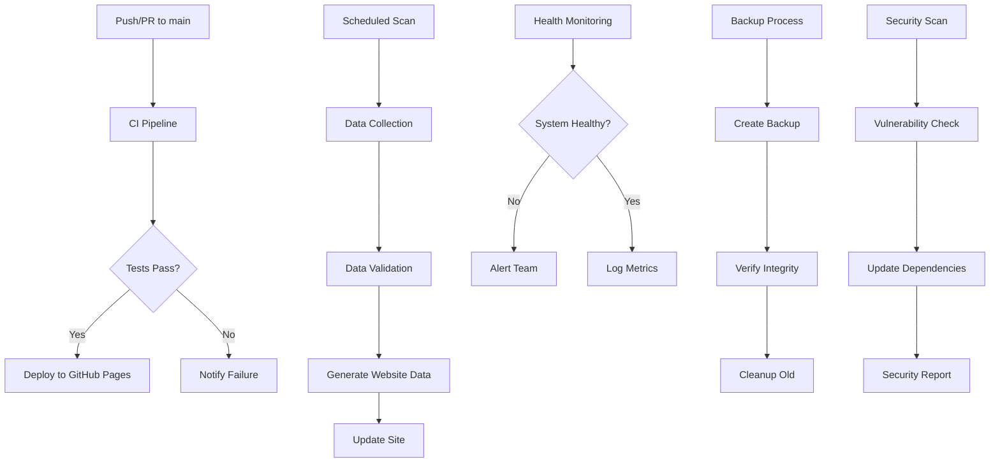

# GitHub Actions Workflows and Maintenance

## Overview

This document provides comprehensive documentation of all GitHub Actions workflows, maintenance schedules, and operational procedures for the Claude Marketplace Aggregator. It covers automated processes, manual interventions, and monitoring procedures.

## Table of Contents

1. [Workflow Architecture](#workflow-architecture)
2. [Core Workflows](#core-workflows)
3. [Monitoring and Alerting](#monitoring-and-alerting)
4. [Maintenance Schedules](#maintenance-schedules)
5. [Manual Procedures](#manual-procedures)
6. [Troubleshooting Guide](#troubleshooting-guide)
7. [Performance Optimization](#performance-optimization)

---

## Workflow Architecture

### Workflow Categories

| Category | Workflows | Purpose | Frequency |
|----------|-----------|---------|-----------|
| **CI/CD** | ci.yml, deploy.yml | Code integration and deployment | On push/PR |
| **Data Processing** | scan.yml, backup.yml | Data collection and backup | Scheduled |
| **Monitoring** | monitoring.yml, performance.yml | System health and performance | Continuous |
| **Security** | security.yml, dependency-update.yml | Security scans and updates | Scheduled |
| **Community** | issue-triage.yml, badges.yml | Community management | Automated |

### Workflow Dependencies



---

## Core Workflows

### 1. Continuous Integration (ci.yml)

**Trigger**: Push to main/develop, Pull requests

**Purpose**: Ensure code quality and functionality

**Steps**:
1. **Code Checkout** - Fetch repository code
2. **Setup Environment** - Configure Node.js and dependencies
3. **Code Quality Checks** - Linting and formatting
4. **Type Checking** - TypeScript validation
5. **Testing** - Unit and integration tests
6. **Build Verification** - Production build test
7. **Security Scanning** - CodeQL and dependency checks
8. **Coverage Reporting** - Test coverage analysis

**Configuration**:
```yaml
Environment:
  Node.js: 18.x
  Cache: npm dependencies
  Timeout: 30 minutes

Required Checks:
- ESLint: No linting errors
- TypeScript: All types valid
- Tests: 90%+ coverage
- Build: Successful production build
- Security: No critical vulnerabilities
```

**Failure Actions**:
- Block merge to main branch
- Notify contributors via PR comments
- Create issue for persistent failures
- Generate detailed failure report

### 2. Deployment (deploy.yml)

**Trigger**: Push to main branch (after CI success)

**Purpose**: Deploy static site to GitHub Pages

**Steps**:
1. **Pre-deployment Checks** - Verify CI passed
2. **Build Process** - Generate static site
3. **Asset Optimization** - Minify and compress
4. **Deployment** - Push to GitHub Pages
5. **Post-deployment Verification** - Health checks
6. **Performance Metrics** - Lighthouse analysis

**Configuration**:
```yaml
Build Settings:
  Output: Static HTML/CSS/JS
  Optimization: Enabled
  Compression: Gzip/Brotli
  Caching: 1 year for assets

Deployment:
  Target: GitHub Pages
  Branch: gh-pages
  Domain: claude-marketplace.github.io
```

**Rollback Procedure**:
```bash
# If deployment fails, rollback to previous version
git checkout HEAD~1 -- .
git push -f origin main
# Trigger manual deployment via GitHub Actions
```

### 3. Data Scanning (scan.yml)

**Trigger**: Every 6 hours (cron), Manual dispatch

**Purpose**: Discover and validate marketplace data

**Steps**:
1. **API Rate Limit Check** - Verify GitHub API availability
2. **Marketplace Discovery** - Search GitHub repositories
3. **Plugin Validation** - Validate marketplace.json files
4. **Data Processing** - Transform and normalize data
5. **Quality Checks** - Verify data integrity
6. **Website Update** - Generate new data files
7. **Deployment** - Update live site

**Configuration**:
```yaml
Scan Settings:
  Frequency: Every 6 hours
  GitHub API: 5000 requests/hour
  Search Query: "claude-plugin marketplace.json"
  Max Repositories: 1000 per scan
  Timeout: 2 hours

Data Validation:
  Schema Validation: Required
  Metadata Verification: Required
  Link Checking: Required
  Content Analysis: Optional
```

**Quality Metrics**:
- Discovery accuracy: >95%
- Validation success rate: >90%
- Data freshness: <6 hours
- Error rate: <5%

### 4. Backup (backup.yml)

**Trigger**: Every 6 hours, Manual dispatch

**Purpose**: Create and manage data backups

**Steps**:
1. **Pre-backup Checks** - Verify data state
2. **Backup Creation** - Compress and store data
3. **Integrity Verification** - Checksum validation
4. **Artifact Storage** - GitHub Actions artifacts
5. **Cleanup Process** - Remove old backups
6. **Backup Reporting** - Generate status report

**Configuration**:
```yaml
Backup Settings:
  Frequency: Every 6 hours
  Retention: 30 days
  Compression: gzip
  Encryption: None (private repo)
  Verification: SHA-256 checksums

Storage Locations:
- Primary: GitHub repository (backups/)
- Secondary: GitHub Actions artifacts
- Tertiary: Local storage (if applicable)
```

**Restore Process**:
```bash
# List available backups
npm run backup list

# Restore from specific backup
npm run backup restore backup-YYYY-MM-DD-HH-mm-ss

# Verify restore
npm run validate:plugins
npm run build
```

---

## Monitoring and Alerting

### Health Monitoring (monitoring.yml)

**Purpose**: Continuous system health monitoring

**Metrics Tracked**:
- API response times
- Data freshness
- GitHub API rate limits
- Memory usage
- Error rates

**Alert Thresholds**:
```yaml
Critical Alerts:
  - Website down: Immediate
  - Data older than 24 hours: Immediate
  - Error rate >10%: Immediate
  - Memory usage >90%: Immediate

Warning Alerts:
  - Response time >2s: 15 minutes
  - Data older than 12 hours: 1 hour
  - Error rate >5%: 30 minutes
  - Memory usage >80%: 30 minutes
```

**Notification Channels**:
- **Primary**: Slack (#monitoring)
- **Secondary**: Email alerts
- **Tertiary**: GitHub Issues (automatic)

### Performance Monitoring (performance.yml)

**Purpose**: Track system performance and identify bottlenecks

**Metrics Collected**:
- Page load times
- API response times
- Bundle sizes
- Core Web Vitals
- Resource loading performance

**Performance Targets**:
```yaml
Web Vitals:
  LCP (Largest Contentful Paint): <2.5s
  FID (First Input Delay): <100ms
  CLS (Cumulative Layout Shift): <0.1
  FCP (First Contentful Paint): <1.8s

API Performance:
  Health endpoint: <500ms
  Status endpoint: <1s
  Analytics endpoint: <2s
  Data endpoints: <1s
```

**Optimization Reports**:
- Weekly performance summaries
- Regression detection
- Bundle size analysis
- Loading time trends

---

## Maintenance Schedules

### Daily Tasks

**Time**: 02:00 UTC (automated), 09:00 UTC (manual check)

**Automated**:
- [ ] Data scanning (every 6 hours)
- [ ] Health checks (every 5 minutes)
- [ ] Performance monitoring (continuous)
- [ ] Backup creation (every 6 hours)
- [ ] Security scanning (daily)

**Manual Checks**:
- [ ] Review monitoring dashboard
- [ ] Check GitHub Actions status
- [ ] Verify user reports/issues
- [ ] Review system metrics
- [ ] Update documentation if needed

### Weekly Tasks

**Day**: Every Sunday

**Automated**:
- [ ] Weekly backup creation
- [ ] Dependency updates
- [ ] Performance report generation
- [ ] Security scan summary
- [ ] Analytics compilation

**Manual Reviews**:
- [ ] Review weekly performance metrics
- [ ] Analyze user feedback trends
- [ ] Check error logs and patterns
- [ ] Update project roadmap
- [ ] Team status meeting

### Monthly Tasks

**Day**: First of each month

**Automated**:
- [ ] Monthly backup creation
- [ ] Comprehensive security audit
- [ ] License compliance check
- [ ] Dependency vulnerability scan
- [ ] Performance trend analysis

**Manual Activities**:
- [ ] Review monthly analytics
- [ ] Update documentation
- [ ] Plan feature improvements
- [ ] Review and update monitoring rules
- [ ] Community engagement review

### Quarterly Tasks

**Automated**:
- [ ] Quarterly backup archiving
- [ ] Comprehensive system audit
- [ ] Security penetration testing
- [ ] Performance benchmarking
- [ ] Cost analysis and optimization

**Manual Reviews**:
- [ ] Strategic planning session
- [ ] Technology stack review
- [ ] Architecture assessment
- [ ] Team performance review
- [ ] Budget and resource planning

---

## Manual Procedures

### Emergency Response

**When**: Critical system failures, security incidents

**Procedure**:
1. **Immediate Assessment** (5-15 minutes)
   - Check monitoring dashboard
   - Verify system status
   - Assess impact scope
   - Notify response team

2. **Incident Response** (15-30 minutes)
   - Create incident ticket
   - Establish communication channels
   - Begin investigation
   - Implement immediate fixes

3. **Recovery Process** (30 minutes - 4 hours)
   - Implement fixes
   - Verify resolution
   - Monitor systems
   - Communicate status

4. **Post-Incident** (1-7 days)
   - Document incident
   - Root cause analysis
   - Implement improvements
   - Team retrospective

### Manual Deployment

**When**: Urgent fixes, feature releases

**Prerequisites**:
- All CI checks passing
- Documentation updated
- Testing completed
- Rollback plan prepared

**Procedure**:
```bash
# 1. Prepare release
git checkout -b release/feature-name
git add .
git commit -m "release: prepare for deployment"

# 2. Quality checks
npm run lint
npm run test
npm run build
npm run type-check

# 3. Merge and deploy
git checkout main
git merge release/feature-name
git push origin main

# 4. Monitor deployment
# Watch GitHub Actions
# Check health endpoints
# Verify functionality

# 5. Post-deployment
# Tag release
# Update changelog
# Notify team
```

### Data Recovery

**When**: Data corruption, accidental deletion

**Procedure**:
```bash
# 1. Assess damage
npm run validate:plugins
curl /api/health
curl /api/status

# 2. Identify backup
npm run backup list
# Review backup timestamps and sizes

# 3. Create emergency backup
npm run backup backup

# 4. Restore from backup
npm run backup restore backup-YYYY-MM-DD-HH-mm-ss

# 5. Verify recovery
npm run validate:plugins
npm run build
npm run start

# 6. Deploy fixed version
git add .
git commit -m "fix: restore data from backup"
git push origin main
```

---

## Troubleshooting Guide

### Common Issues

#### 1. GitHub API Rate Limiting

**Symptoms**:
- 403 Forbidden errors
- Slow data updates
- Missing marketplace data

**Solutions**:
```bash
# Check current rate limit
curl -H "Authorization: token $GITHUB_TOKEN" \
     https://api.github.com/rate_limit

# If rate limited, wait for reset
# Reset time is in the API response

# Reduce scan frequency temporarily
# Edit .github/workflows/scan.yml
# Modify cron schedule
```

**Prevention**:
- Monitor rate limit usage
- Implement caching
- Use efficient search queries
- Consider multiple tokens

#### 2. Build Failures

**Symptoms**:
- GitHub Actions build fails
- TypeScript errors
- Dependency issues

**Solutions**:
```bash
# Local debugging
npm run build
npm run type-check
npm run lint

# Fix dependency issues
npm ci --force
npm audit fix

# Update dependencies
npm update
npm install
```

**Prevention**:
- Regular dependency updates
- Automated testing
- Pre-commit hooks
- Staged deployments

#### 3. Data Validation Errors

**Symptoms**:
- Missing plugin data
- Invalid JSON files
- Schema validation failures

**Solutions**:
```bash
# Validate current data
npm run validate:plugins

# Regenerate data
npm run scan:full
npm run generate:data

# Check specific files
jq empty public/data/marketplaces.json
jq empty public/data/plugins.json
```

**Prevention**:
- Regular validation checks
- Schema versioning
- Gradual data updates
- Rollback procedures

#### 4. Performance Issues

**Symptoms**:
- Slow page loads
- High memory usage
- API timeouts

**Solutions**:
```bash
# Check performance metrics
curl /api/metrics

# Monitor memory usage
node --inspect scripts/scan-marketplaces.ts

# Optimize bundles
npm run build -- --analyze

# Clear cache
rm -rf .next
rm -rf node_modules/.cache
```

**Prevention**:
- Regular performance monitoring
- Bundle size optimization
- Memory leak detection
- Caching strategies

### Debugging Tools

#### Local Development
```bash
# Enable debug logging
DEBUG=* npm run dev

# Performance profiling
node --prof scripts/scan-marketplaces.ts
node --prof-process isolate-*.log > performance.txt

# Memory profiling
node --inspect scripts/scan-marketplaces.ts
# Open Chrome DevTools > Node.js icon
```

#### Production Debugging
```bash
# Check health status
curl https://claude-marketplace.github.io/aggregator/api/health

# Detailed system status
curl https://claude-marketplace.github.io/aggregator/api/status

# Performance metrics
curl https://claude-marketplace.github.io/aggregator/api/metrics

# Analytics data
curl https://claude-marketplace.github.io/aggregator/api/analytics
```

#### Log Analysis
```bash
# GitHub Actions logs
gh run list --repo claude-marketplace/aggregator
gh run view <run-id> --repo claude-marketplace/aggregator

# Download workflow logs
gh run download <run-id> --repo claude-marketplace/aggregator

# Analyze error patterns
grep -r "ERROR" .github/workflows/
```

---

## Performance Optimization

### Monitoring Setup

#### Custom Metrics
```typescript
// Add custom performance monitoring
import performanceMonitor from '../utils/performance-monitor';

// Monitor API calls
performanceMonitor.recordApiCall('/api/health', 'GET', responseTime, 200);

// Monitor function execution
await performanceMonitor.measureFunction('data-processing', async () => {
  // Your code here
});

// Monitor memory usage
performanceMonitor.recordMemoryUsage();
```

#### Alert Configuration
```yaml
# Performance alerts in monitoring.yml
- name: Performance Alert
  if: response_time > 2000
  run: |
    echo "Slow response detected: ${{ steps.check.outputs.response_time }}ms"
    # Send alert notification
```

### Optimization Strategies

#### Data Processing
- Implement pagination for large datasets
- Use efficient search algorithms
- Cache frequently accessed data
- Optimize database queries

#### Frontend Performance
- Implement lazy loading
- Optimize bundle sizes
- Use service workers
- Enable compression

#### API Performance
- Add response caching
- Implement rate limiting
- Use CDN for static assets
- Optimize JSON payloads

### Benchmarking

#### Regular Tests
```bash
# Performance benchmarks
npm run test:performance

# Lighthouse CI
npm run lighthouse

# Bundle analysis
npm run build -- --analyze

# Memory profiling
npm run profile:memory
```

#### Metrics to Track
- Page load time
- Time to interactive
- Bundle sizes
- API response times
- Memory usage
- Error rates

---

## Maintenance Checklist

### Daily Checklist

**System Health**:
- [ ] Check monitoring dashboard
- [ ] Verify all health endpoints
- [ ] Review error logs
- [ ] Check GitHub Actions status

**Data Quality**:
- [ ] Verify data freshness
- [ ] Check validation results
- [ ] Review scan reports
- [ ] Monitor backup status

**Performance**:
- [ ] Review response times
- [ ] Check memory usage
- [ ] Monitor API rates
- [ ] Verify site accessibility

### Weekly Checklist

**Security**:
- [ ] Review security scan results
- [ ] Check for new vulnerabilities
- [ ] Update dependencies
- [ ] Review access logs

**Maintenance**:
- [ ] Clean up old artifacts
- [ ] Review backup retention
- [ ] Update documentation
- [ ] Check disk usage

**Analytics**:
- [ ] Review usage metrics
- [ ] Analyze performance trends
- [ ] Check error patterns
- [ ] Generate weekly report

### Monthly Checklist

**System Updates**:
- [ ] Update Node.js version
- [ ] Review and update dependencies
- [ ] Check for deprecated APIs
- [ ] Update security policies

**Documentation**:
- [ ] Update project documentation
- [ ] Review API documentation
- [ ] Update deployment guides
- [ ] Check for outdated information

**Planning**:
- [ ] Review monthly metrics
- [ ] Plan feature improvements
- [ ] Assess technical debt
- [ ] Update project roadmap

---

**Last Updated**: October 17, 2024
**Next Review Date**: January 17, 2025
**Maintained By**: Infrastructure Team

For questions or updates to this documentation, please create an issue in the GitHub repository or contact the maintenance team.