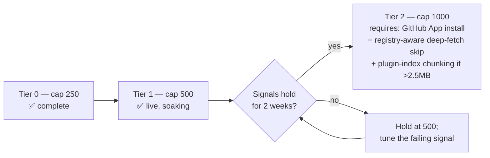

# Catalog Scaling Tiers — the `SEARCH_RESULTS_LIMIT` ladder

Status: **Tier 1 live** (cap `500`, soak in progress)
Owner: pipeline maintainers · Last reviewed: 2026-09-24

This guide documents the staged raise of `SEARCH_RESULTS_LIMIT` — the
per-run discovery budget (`scripts/scan-marketplaces.ts`, env wired in
`.github/workflows/scan.yml`) — and the signals that gate each step.

**Mental model:** the cap is a *throughput dial*, not a catalog size
target. Catalog size = registry − retirements − deleted repos, and it
grows toward the addressable pool regardless. The cap controls daily work
volume (search listings, deep-fetches, enrichment asks) — and therefore
runtime, quota burn, and how fast noise enters.

## Measured baselines

| Signal | @ cap 250 | @ cap 500 (current) |
|---|---|---|
| Scan job duration | 16–18 min | ~2× expected (~30–35 min); verify per run |
| Catalog size | 325 (2026-09-23) | 370 (2026-09-24) |
| `marketplaces.json` (site download) | 150 KB | 252 KB |
| `plugins.json` index (site download) | 1.4 MB | 1.4 MB |
| Deep-fetch cost per new candidate | ~3–5 core API calls | same |
| Registry slice (staleness refresh) | 100 repos/run | same |

## The ladder

## Tier 1 — cap 500 (live, soaking since 2026-09-24)

Prerequisites all met before the raise: bot PAT live (PR #379 verified the
identity end-to-end), enrichment keys live (provider chain:
vercel-gateway → typesafe-direct), triage loop live (#361), payload
mitigations merged (#360, #369), star-band strategies merged (#370).

**Stay-signals — check after each daily run:**

1. **Pipeline health:** all 5 jobs green; data-update PR authored by
   `shrwnsan-bot`, auto-merged; **zero 403s** in the scan-step log.
2. **Runtime:** scan job **≤ 45 min** (baseline 16–18 min @250; scales
   roughly linearly with the deep-fetch count).
3. **Quota headroom:** the bot account's `rate_limit` shows **≥50% of the
   hourly pool remaining** right after a run (check once per day max).
4. **Discovery quality:** triage retirements stay **< ~40% of new
   discoveries**; catalog net growth positive; categorized coverage
   (topic alias + Jev) not shrinking.
5. **Payload:** `plugins.json` index (the list-page download) stays
   **< ~2.5 MB raw** (1.4 MB today). `marketplaces.json` is unconstrained
   until several MB.
6. **Enrichment:** step < 5 min, no final provider failures (gateway 429
   bursts absorbed by failover are fine).

## Tier 2 — cap 1000 (gated on three work items)

Raw call math makes 1000 unreachable on the current setup: ~4–6 core
calls × 1000 candidates ≈ 5–6k calls, which exceeds the 5,000/hr pool the
run itself draws from. Entry requires all of:

1. **GitHub App installed on the repo** — same 5,000/hr as a user PAT on
   a free plan (15,000 is Enterprise Cloud), but it ends token rotation
   and moves billing/limits to an org-managed identity. Install behind an
   org (`shrwnsan-labs`), which also re-enables fine-grained tokens.
2. **Registry-aware deep-fetch skip** — seed the scanner with registry
   ids before search strategies so already-cataloged repos are skipped
   before paying manifest+skills calls (they are re-fetched by the
   rotating slice or carried anyway). This collapses Tier-2 marginal cost
   to genuinely-new candidates (tens/day) and is the single biggest
   enabler.
3. **Plugin-index chunking** — `plugins-<n>.json` windows for the list
   page if the index crossed the 2.5 MB signal at Tier 1.

## Known constraints (documented so nobody re-derives them)

- **GitHub code search silently ignores `stars:`** (returns 0 rows, no
  error). Star-banding is valid only on repo-type strategies (#370).
- **Rate limits are per-account, not per-token** — `.env.local`, `gh`
  CLI, and pipeline secrets share one pool per identity. The bot account
  exists to keep the pipeline pool separate from human usage.
- **`download-artifact` overlays files; it never deletes** — retiring a
  generated file requires an explicit `rm` in the workflow job that
  builds the data-update PR (#380).

## Review cadence

Re-read this guide at each tier transition. If a stay-signal fails for
three consecutive runs, stop soaking, fix the failing subsystem, and only
then re-enter the soak.
