# GitHub Actions Workflow Architecture

## Overview

This document provides comprehensive visual diagrams and documentation for all GitHub Actions workflows in the Claude Marketplace Aggregator project. It includes workflow relationships, trigger mappings, dependency graphs, and data flow diagrams.

---

## Table of Contents

1. [Workflow Ecosystem Overview](#workflow-ecosystem-overview)
2. [Workflow Categories](#workflow-categories)
3. [Trigger Mapping](#trigger-mapping)
4. [Workflow Dependencies](#workflow-dependencies)
5. [Data Flow Diagrams](#data-flow-diagrams)
6. [Job Dependencies](#job-dependencies)
7. [Security & Permissions](#security--permissions)
8. [Timeline & Frequency](#timeline--frequency)

---

## Workflow Ecosystem Overview

### Complete Workflow Map

```mermaid
graph TB
    subgraph "CI/CD Pipeline"
        CI[ci.yml]
        DEPLOY[deploy.yml]
    end

    subgraph "Data Processing"
        SCAN[scan.yml]
        BACKUP[backup.yml]
    end

    subgraph "Monitoring & Analysis"
        MONITOR[monitoring.yml]
        PERF[performance.yml]
    end

    subgraph "Security & Maintenance"
        SEC[security.yml]
        DEPS[dependency-update.yml]
    end

    subgraph "Community & AI"
        TRIAGE[issue-triage.yml]
        CLAUDE[claude-code.yml]
        OPENCODE[opencode.yml]
    end

    %% Event triggers
    PUSH[Push to main/develop] --> CI
    PUSH --> DEPLOY
    PUSH --> SEC
    PR[Pull Request] --> CI
    PR --> SEC
    PR --> TRIAGE

    %% Scheduled triggers
    SCHEDULE_6H[Every 6 hours] --> SCAN
    SCHEDULE_6H --> BACKUP
    SCHEDULE_DAILY[Daily 2:00 UTC] --> SEC
    SCHEDULE_5MIN[Every 5 min] --> MONITOR
    SCHEDULE_WEEKLY[Weekly Sundays] --> PERF
    SCHEDULE_MON[Weekly Mondays] --> DEPS

    %% Manual triggers
    MANUAL[Workflow Dispatch] --> SCAN
    MANUAL --> DEPLOY
    MANUAL --> PERF
    MANUAL --> BACKUP

    %% Issue/PR events
    ISSUE[Issue opened/commented] --> TRIAGE
    ISSUE --> CLAUDE
    ISSUE --> OPENCODE
    PRCOMMENT[PR Comment] --> CLAUDE
    PRCOMMENT --> OPENCODE

    %% Workflow dependencies
    CI -->|success| DEPLOY
    SCAN -->|data updated| DEPLOY
    SEC -.->|vulnerability found| DEPS

    %% Style
    classDef cicd fill:#4CAF50,stroke:#2E7D32,color:#fff
    classDef data fill:#2196F3,stroke:#1565C0,color:#fff
    classDef monitor fill:#FF9800,stroke:#E65100,color:#fff
    classDef sec fill:#F44336,stroke:#C62828,color:#fff
    classDef community fill:#9C27B0,stroke:#6A1B9A,color:#fff

    class CI,DEPLOY cicd
    class SCAN,BACKUP data
    class MONITOR,PERF monitor
    class SEC,DEPS sec
    class TRIAGE,CLAUDE,OPENCODE community
```

### Workflow Statistics

| Category | Count | Total Runtime/Day | Secrets Required |
|----------|-------|-------------------|------------------|
| CI/CD | 2 | ~10 min | GITHUB_TOKEN |
| Data Processing | 2 | ~20 min | GITHUB_TOKEN |
| Monitoring | 2 | ~15 min | WEBHOOK_URL (optional) |
| Security | 2 | ~8 min | GITLEAKS_LICENSE (optional) |
| Community/AI | 3 | On-demand | ANTHROPIC_API_KEY, OPENCODE_ZAI_API_KEY |

---

## Workflow Categories

### 1. CI/CD Pipeline

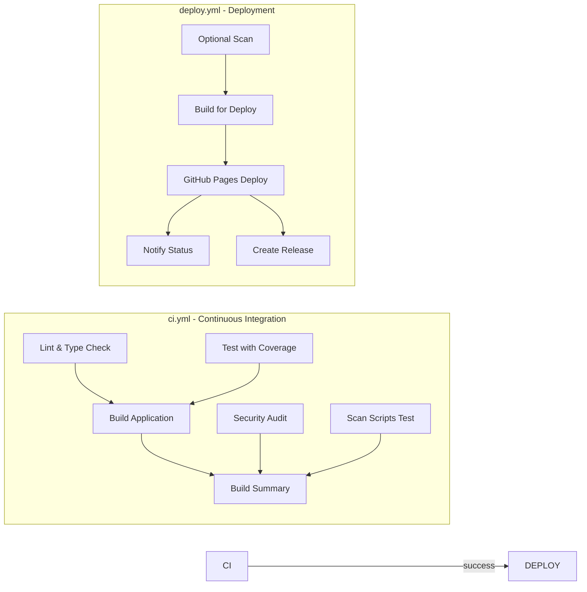

**Purpose**: Code quality validation and production deployment

**Key Features**:
- Multi-stage validation (lint, test, build)
- Artifact caching and reuse
- CodeQL security analysis
- Automatic GitHub Pages deployment
- Tag-based release creation

**Triggers**:
- Push to `main` or `develop` branches
- Pull requests to `main` or `develop`
- Manual workflow dispatch
- Git tags (for releases)

---

### 2. Data Processing

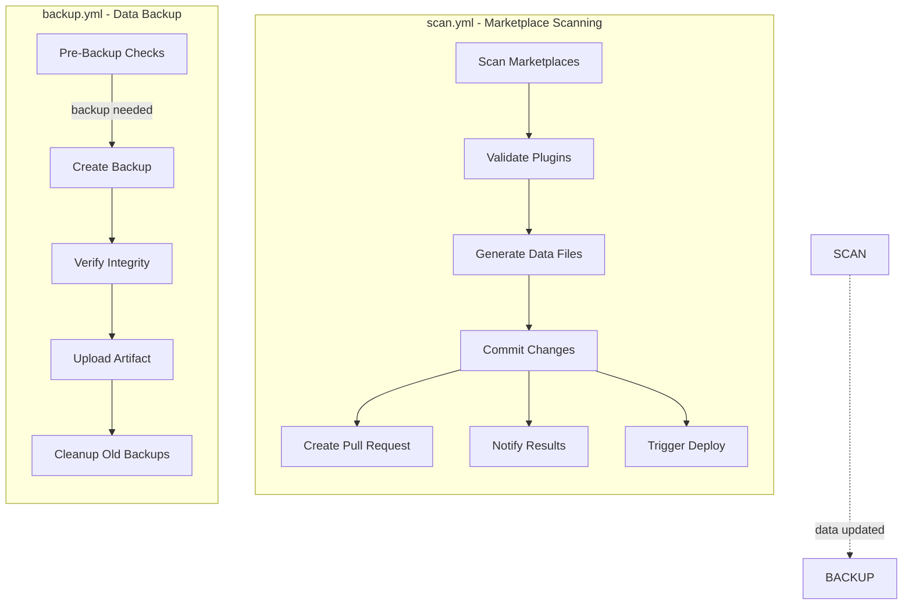

**Purpose**: Automated data collection and backup

**Key Features**:
- GitHub API integration for marketplace discovery
- Plugin validation and metadata extraction
- Automatic data file generation
- Backup with integrity verification
- Incremental updates with smart caching

**Triggers**:
- Scheduled every 6 hours (`0 */6 * * *`)
- Manual dispatch with options (full/marketplaces/validation/data)

---

### 3. Monitoring & Analysis

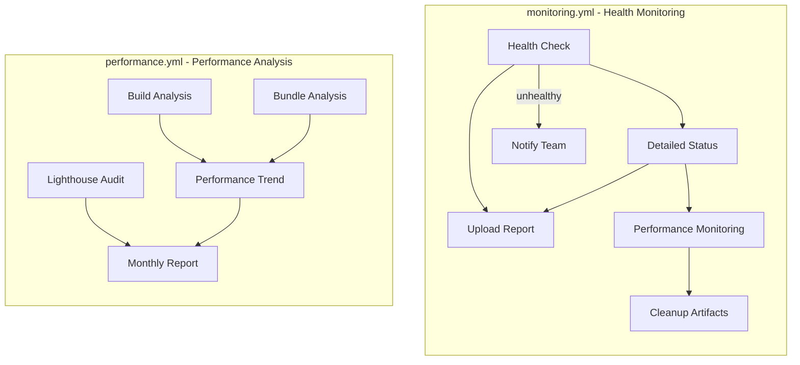

**Purpose**: System health monitoring and performance tracking

**Key Features**:
- 5-minute health check intervals
- Response time tracking
- Lighthouse performance audits
- Bundle size analysis
- Monthly performance reports

**Triggers**:
- Monitoring: Every 5 minutes (`*/5 * * * *`)
- Performance: Weekly Sundays at 3:00 UTC (`0 3 * * 0`)

---

### 4. Security & Maintenance

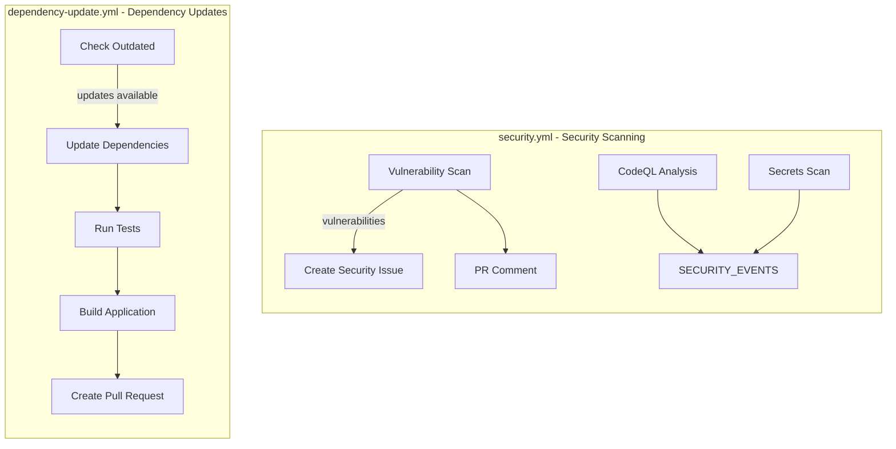

**Purpose**: Security vulnerability detection and dependency maintenance

**Key Features**:
- Daily npm audit with automated issue creation
- CodeQL advanced static analysis
- Secrets detection (TruffleHog + Gitleaks)
- Weekly dependency updates with PR creation
- PR security comments

**Triggers**:
- Security: Daily at 2:00 UTC, push to main, PRs
- Dependencies: Weekly Mondays at 9:00 UTC

---

### 5. Community & AI Assistants

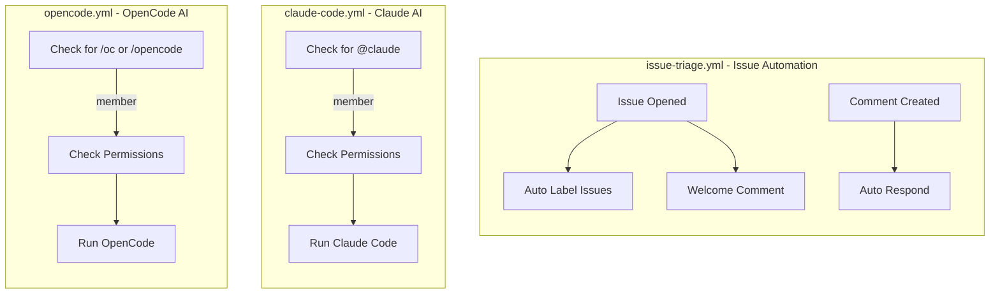

**Purpose**: Community management and AI-assisted development

**Key Features**:
- Automatic issue labeling based on content
- Welcome comments for new issues
- Context-aware responses to common questions
- AI-powered code assistance (Claude + OpenCode)
- Member-only access for AI features

**Triggers**:
- Issue/PR events (opened, edited, commented)
- Commands: `@claude`, `/opencode`, `/oc`

---

## Trigger Mapping

### Event-Based Triggers

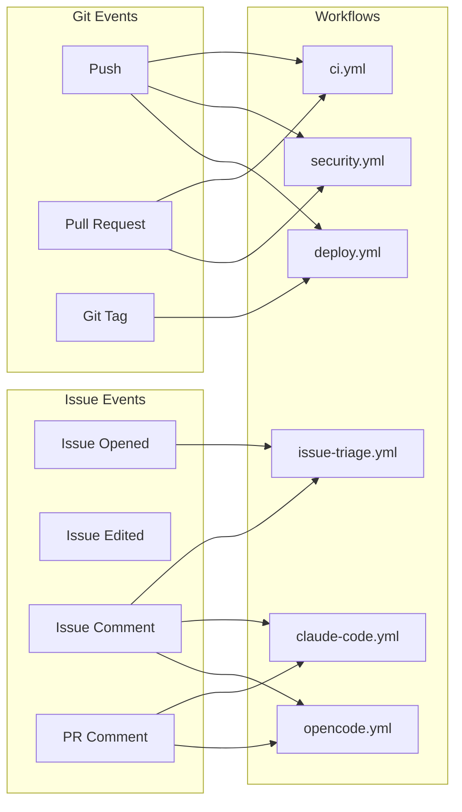

### Scheduled Triggers

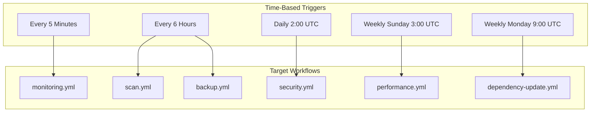

### Manual Triggers

All workflows support manual dispatch via GitHub Actions UI with varying options:

| Workflow | Input Options |
|----------|--------------|
| `deploy.yml` | `scan_before_deploy` (boolean) |
| `scan.yml` | `scan_type` (choice), `force_update` (boolean), `commit_changes` (boolean) |
| `performance.yml` | `analyze_build` (boolean), `analyze_bundle` (boolean), `analyze_lighthouse` (boolean) |
| `backup.yml` | `backup_type` (choice), `force_backup` (boolean), `restore_backup` (string) |
| `monitoring.yml` | `detailed_check` (boolean), `notify_on_success` (boolean) |

---

## Workflow Dependencies

### Dependency Graph

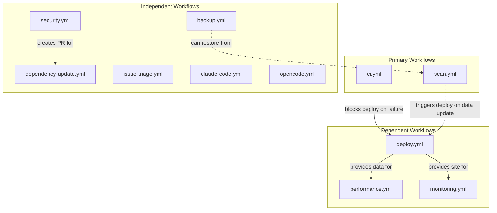

### Hard Dependencies

- **deploy.yml** requires **ci.yml** to pass on the same commit
- **deploy.yml** optional scan job requires **scan.yml** data

### Soft Dependencies

- **performance.yml** assumes site is deployed (doesn't block)
- **monitoring.yml** checks deployed site (doesn't block)
- **dependency-update.yml** may be triggered by **security.yml** findings

---

## Data Flow Diagrams

### CI/CD Data Flow

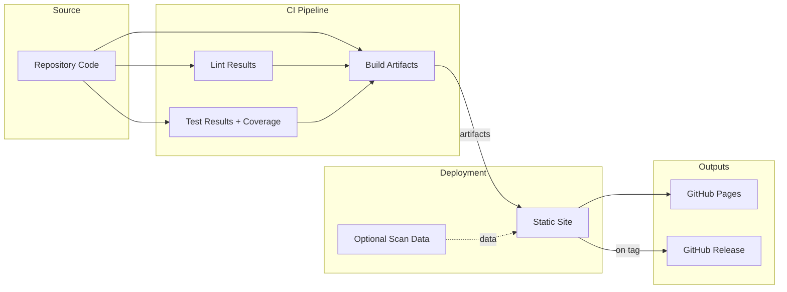

### Data Processing Flow

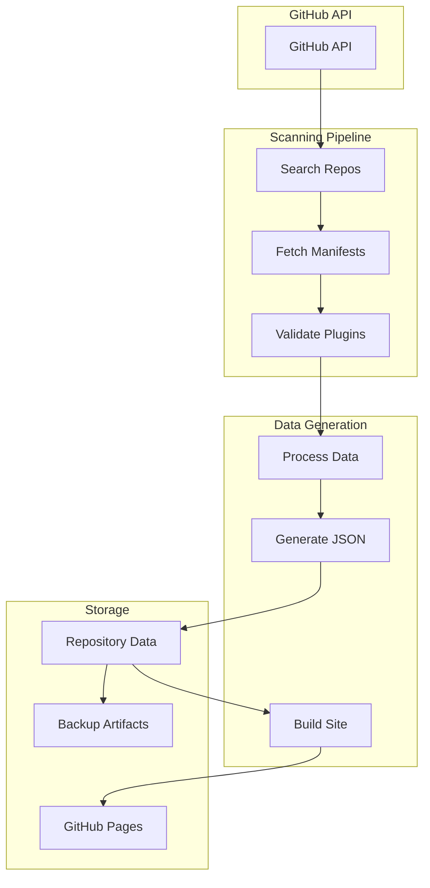

### Monitoring Data Flow

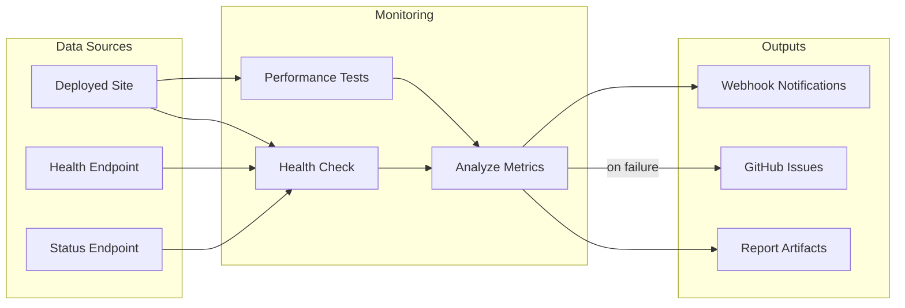

---

## Job Dependencies

### ci.yml Job Graph

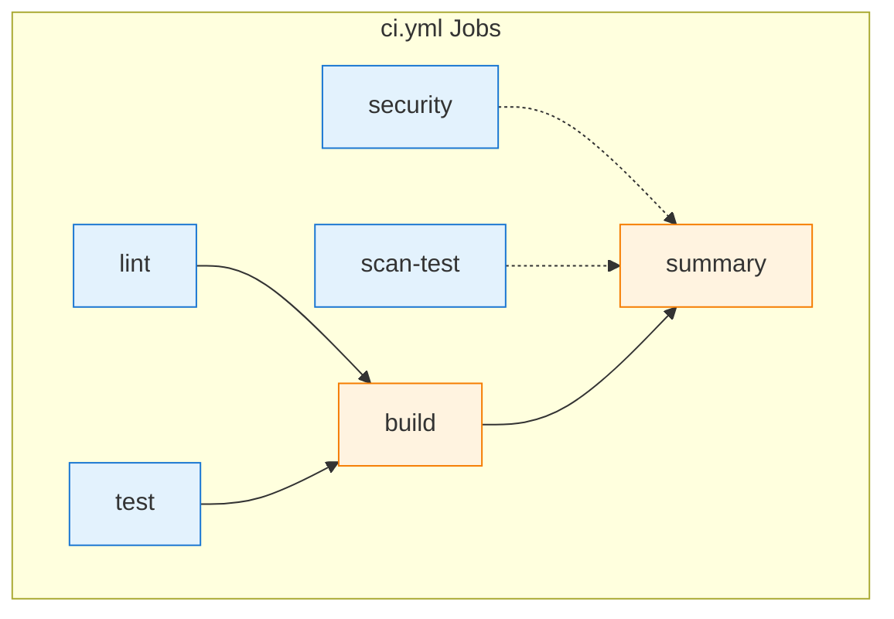

### scan.yml Job Graph

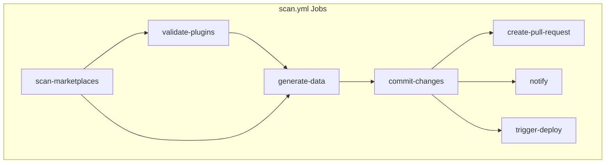

### deploy.yml Job Graph

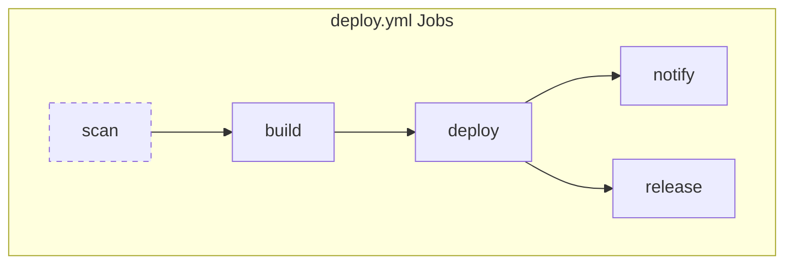

---

## Security & Permissions

### Permission Matrix

| Workflow | contents: read | contents: write | actions: read | security-events: write | pages: write | id-token: write | pull-requests: write | issues: write |
|----------|----------------|-----------------|---------------|------------------------|--------------|-----------------|----------------------|---------------|
| ci.yml | ✅ | | ✅ | ✅ | | | | |
| deploy.yml | ✅ | | | | ✅ | ✅ | | |
| scan.yml | ✅ | | | | | | ✅ | |
| security.yml | ✅ | | ✅ | ✅ | | | ✅ | |
| monitoring.yml | ✅ | | | | | | | |
| performance.yml | ✅ | | | | | | ✅ | |
| dependency-update.yml | ✅ | | | | | | ✅ | |
| issue-triage.yml | ✅ | | | | | | | ✅ |
| backup.yml | ✅ | | | | | | | |
| claude-code.yml | ✅ | ✅ | ✅ | | | ✅ | ✅ | ✅ |
| opencode.yml | ✅ | ✅ | | | | ✅ | ✅ | ✅ |

### Secrets Usage

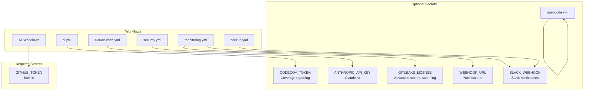

---

## Timeline & Frequency

### Weekly Schedule

```mermaid
gantt
    title Weekly Workflow Schedule
    dateFormat X
    axisFormat %a

    section Daily
    Security Scan        :mon, 02:00, 1d
    Backup (6h)         :mon, 1d

    section Weekly
    Dependency Update    :mon, 09:00, 1d
    Performance Analysis :sun, 03:00, 1d

    section Continuous
    Marketplace Scan     :mon, 1d
    Health Monitoring    :mon, 1d
```

### Runtime Estimates

| Workflow | Average Duration | Frequency | Daily Runtime |
|----------|------------------|-----------|---------------|
| ci.yml | 3-5 min | On push/PR | Variable |
| deploy.yml | 2-3 min | On push to main | Variable |
| scan.yml | 5-10 min | Every 6h | ~20 min |
| backup.yml | 1-2 min | Every 6h | ~4 min |
| security.yml | 2-4 min | Daily | ~3 min |
| monitoring.yml | 1-2 min | Every 5 min | ~288 min |
| performance.yml | 5-8 min | Weekly | ~1 min/day |
| dependency-update.yml | 3-5 min | Weekly | ~1 min/day |

---

## Quick Reference

### Workflow Commands

```bash
# Trigger workflows manually
gh workflow run ci.yml
gh workflow run deploy.yml
gh workflow run scan.yml -f scan_type=full
gh workflow run performance.yml
gh workflow run backup.yml -f backup_type=daily

# View workflow status
gh run list --workflow=ci.yml
gh run view <run-id>
gh run watch <run-id>

# View workflow logs
gh run view <run-id> --log
gh run download <run-id>

# List workflows
gh workflow list
```

### Troubleshooting Commands

```bash
# Check GitHub Actions status
curl -s https://www.githubstatus.com/api/v2/status.json

# Verify repository permissions
gh api repos/:owner/:repo/actions/permissions

# Check workflow runs
gh run list --limit 20

# Cancel a workflow
gh run cancel <run-id>

# Re-run a workflow
gh run rerun <run-id>
```

---

## Related Documentation

- [MAINTENANCE_GUIDE.md](MAINTENANCE_GUIDE.md) - Operational procedures and monitoring
- [DISASTER_RECOVERY.md](DISASTER_RECOVERY.md) - Backup and recovery procedures
- [DEPLOYMENT-SUMMARY.md](DEPLOYMENT-SUMMARY.md) - Deployment configuration
- [.github/workflows/README.md](../.github/workflows/README.md) - Workflow configuration details

---

**Last Updated**: 2025-01-17
**Version**: 1.0.0
**Maintained By**: Infrastructure Team
